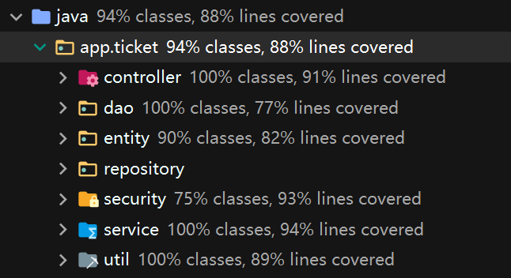
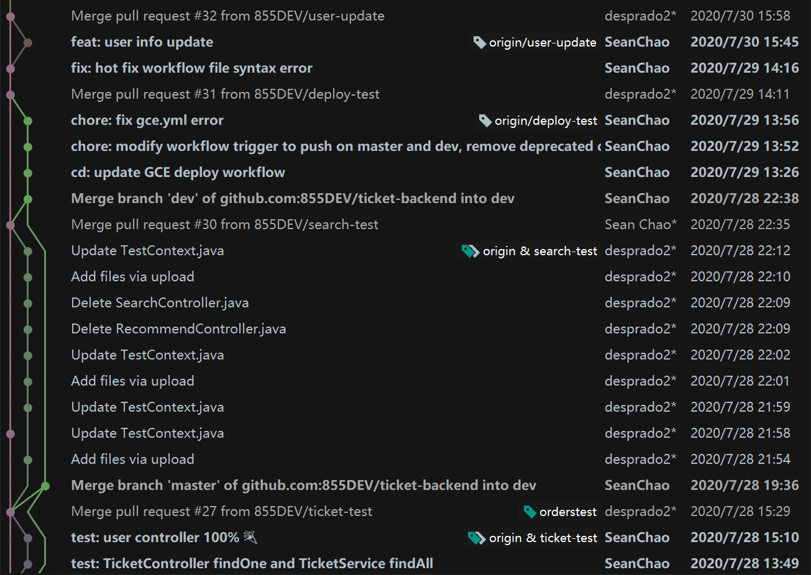
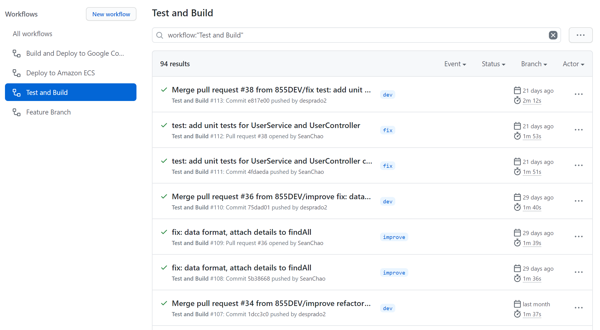
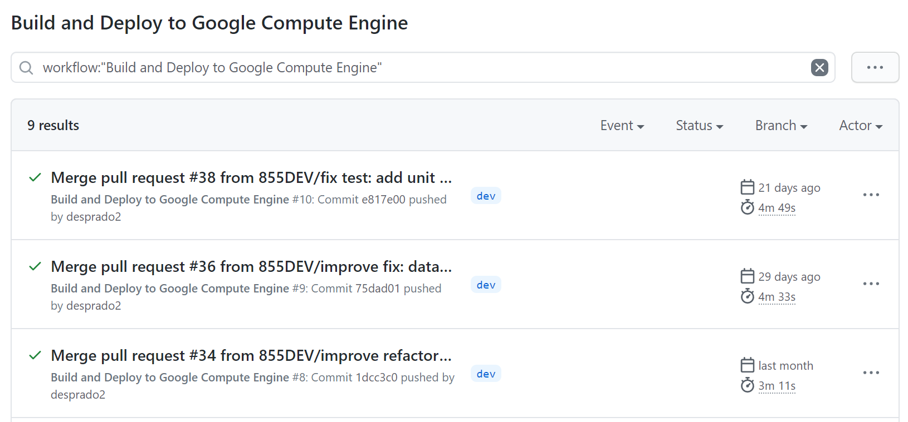

# 聚票网后端文档

## 功能需求

聚票网后端工程是为聚票网前端进行服务的。通过调研 ，我们总结了该应用在实际生活中的场景，综合考虑用户需求之后，确定了如下的功能性需求。

### 票务信息

聚票网的核心功能是围绕票务信息进行设计的。基本的功能包括查询票务信息、根据用户指定的条件搜索票务信息、管理员的票务信息增加、删除与修改。

### 用户服务

与用户相关的功能包括用户个人信息的显示、修改，以及购票、订单查询。

## 架构设计

聚票网的后端工程使用 [Spring Boot](https://spring.io/projects/spring-boot) 进行开发，使用了 MVC 分层架构。

### 模块分层

后端工程的代码基于 MVC 架构分为了数个相互之间解耦的模块。

最外层为 `controller` 层，提供暴露给外部访问的 API 。 `controller` 层负责处理来自用户的 HTTP 请求，并调用下层服务获取数据，将数据封装后作为响应返回给用户。

`service` 层负责处理来自 controller 层的需求，实现了各种功能性需求。

`dao` 层为数据访问接口，负责封装底层不同的数据来源，为上层接口提供抽象的统一数据接口。

`repository` 层负责处理具体的数据库逻辑。

`entity` 层完成Java 对象与数据库表之间的 OR 映射。

## 测试

对于后端工程，我们进行了大面积的单元测试。单元测试主要针对 `controller` 层与 `service` 层。通过单元测试，我们保证了应用中用户所使用的各个功能及其中涉及到的模块都能正常运作。在单元测试中我们也使用了一些非预期的输入进行测试，确保应用在意外状况下也能保持可用，不会意外崩溃。

数据显示，单元测试的覆盖率达到了 90% 左右。

## 开发与运维

我开发过程中，我们使用了 git 与 GitHub 进行版本控制。新的功能或代码都会在新的分支上进行开发，通过 pull request (PR) 合并入 `dev` 分支，并最终合并入 `master` 分支。

### 持续集成

在项目开发过程中，我们使用了 GitHub Actions 作为持续集成(CI) 的工具来保证代码质量。在每一次 push 或 pull request 之后，GitHub Actions  都会自动运行单元测试并尝试构建，确保首要分支上的代码始终是可用的。

### 持续部署

当主分支(master)上并入了新的代码后，会触发部署工作流。首先是进行测试，测试通过后会根据仓库内的 `Dockerfile` 打包一个容器镜像，将镜像发布至 Google Container Registry (GCR) ，并部署到 Google Compute Engine (GCE) ，完成新的服务的上线使用。

## 微服务

我们也尝试使用微服务来部署我们的应用。我们在谷歌云上创建了一个 Kubernetes 集群，部署了打包好的容器，增加了负载均衡器并启用了 Auto Scaling, 使得我们的服务更具有弹性。
